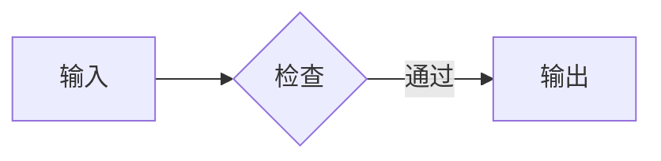

# Markdown 全格式测试

本文件是 QingYu Markdown 编辑器的固定格式基准。测试编号不得因内容重排而复用。

## 文档结构

### D01-YAML Front Matter

文档顶部包含标题与标签字段，视觉模式应隐藏元数据但保留源文本。

### D02-普通段落

这是一段包含中文、English、数字 12345、标点符号，以及足够长文本用于观察自动换行和段落间距的普通正文。

### D03-软换行

第一行使用普通换行
第二行仍属于同一段落。

### D04-硬换行

第一行末尾使用反斜杠\
第二行应显示为明确换行。

### D05-转义实体与 Unicode

转义字符：\*不是强调\*、\#不是标题；实体：&amp; &lt; &copy;；Unicode：中文、🙂、𝛑、é。

## 标题

# H01-ATX 一级标题

## H02-ATX 二级标题

### H03-ATX 三级标题

#### H04-ATX 四级标题

##### H05-ATX 五级标题

###### H06-ATX 六级标题

H07-Setext 一级标题
==================

H08-Setext 二级标题
------------------

### H09-很长的标题用于检查在较窄窗口中的换行、行高、上下边距以及标题尾部光标位置是否稳定

### H10-连续标题第一行

#### 连续标题第二行

连续标题后的正文用于检查边界间距。

## 行内格式

### I01-粗体

普通文字与 **粗体文字** 位于同一行。

### I02-斜体

普通文字与 *斜体文字* 位于同一行。

### I03-粗斜体

普通文字与 ***粗斜体文字*** 位于同一行。

### I04-删除线

普通文字与 ~~删除线文字~~ 位于同一行。

### I05-高亮

普通文字与 ==高亮文字== 位于同一行。

### I06-行内代码

普通文字与 `const value = 42;` 位于同一行。

### I07-嵌套组合

**粗体中包含 *斜体* 与 `code`**，并与 ~~删除线中的 ==高亮==~~ 相邻。

### I08-边界标点

（**中文粗体**）、“*中文斜体*”、`inline()`；标点前后应自然衔接。

### I09-代码反引号

双反引号允许 ``包含 ` 的代码``，空格与边界不应丢失。

### I10-长行内组合

这是一个很长的段落，包含 **粗体**、*斜体*、~~删除线~~、==高亮==、`inlineCode` 与 [链接](#i10-长行内组合)，用于检查自动换行时基线和装饰是否连续。

## 链接

### A01-行内链接

[访问示例站点](https://example.com)。

### A02-带标题链接

[带标题的链接](https://example.com "示例标题")。

### A03-自动链接

<https://example.com/path?q=markdown>。

### A04-电子邮件链接

<format@example.com>。

### A05-引用链接

[引用式链接][reference-link] 与 [简写引用][]。

[reference-link]: https://example.com/reference "引用标题"
[简写引用]: https://example.com/short

### A06-锚点与安全降级

[跳转到文档顶部](#markdown-全格式测试)，以及应保持为文本的 [缺失引用][not-defined]。

## 列表

### L01-紧凑无序列表

- 第一项
- 第二项
- 第三项

### L02-多种无序标记

* 星号项目
+ 加号项目
- 减号项目

### L03-非一开始的有序列表

4. 第四项
5. 第五项
6. 第六项

### L04-宽松列表

- 第一项第一段。

  第一项第二段。

- 第二项。

### L05-三级嵌套列表

- 一级项目
  - 二级项目
    1. 三级有序项目
    2. 三级第二项
  - 二级第二项
- 一级第二项

### L06-任务列表

- [ ] 未完成任务
- [x] 已完成任务
- [X] 大写完成标记

### L07-列表内多种块

1. 列表中的段落

   > 列表中的引用

2. 列表中的代码：

       const nested = true;

### L08-长文本换行

- 这是一个足够长的列表项目，用于检查窄窗口中自动换行后的悬挂缩进、项目符号位置、行高和下一项目之间的垂直节奏是否与原生编辑器一致。
- 第二项用于标记列表末端。

## 引用

### Q01-简单引用

> 一行普通引用。

### Q02-多段引用

> 第一段引用。
>
> 第二段引用，轨道应连续。

### Q03-引用内格式

> 引用包含 **粗体**、*斜体*、`inlineCode` 和 [链接](https://example.com)。

### Q04-标题空行列表复合引用

> **复合引用标题**：
>
> - 第一项包含 `inlineCode`
>
> - 第二项包含 **粗体**
>
> - 第三项用于验证连续轨道末端

### Q05-嵌套引用

> 外层引用开始
>
> > 内层引用
> >
> > - 内层列表
>
> 外层引用结束

### Q06-引用内标题

> #### 引用中的四级标题
>
> 标题下方正文仍在同一容器中。

### Q07-引用内代码块

> 引用中的代码：
>
> ```ts
> const quoted = true;
> ```

### Q08-引用边界

引用前正文。

> 第一行。
> 第二行。

引用后正文。

## Callout

### C01-NOTE

> [!NOTE]
> Note 内容。

### C02-TIP

> [!TIP]
> Tip 内容。

### C03-IMPORTANT

> [!IMPORTANT]
> Important 内容。

### C04-WARNING

> [!WARNING]
> Warning 内容。

### C05-CAUTION

> [!CAUTION]
> Caution 内容。

## 分割线

### R01-减号分割线

---

### R02-星号分割线

***

### R03-下划线分割线

___

### R04-分割线上下边界

分割线上方正文。

---

分割线下方正文。

## 表格

### T01-基础表格

| 项目 | 内容 |
| --- | --- |
| 版本 | v1.0 |
| 状态 | 测试中 |

### T02-对齐表格

| 左对齐 | 居中 | 右对齐 |
| :--- | :---: | ---: |
| left | center | 42 |

### T03-转义竖线

| 语法 | 结果 |
| --- | --- |
| `a \| b` | a \| b |

### T04-空单元格

| 第一列 | 第二列 | 第三列 |
| --- | --- | --- |
| 值 |  | 值 |
|  | 中间 |  |

### T05-行内格式表格

| 粗体 | 代码 | 链接 |
| --- | --- | --- |
| **重点** | `cell()` | [示例](https://example.com) |

### T06-长内容表格

| 标识 | 说明 |
| --- | --- |
| long-row | 这是一个用于检查表格横向溢出、列宽分配、单元格换行和滚动容器行为的长文本单元格。 |

## 代码

### K01-行内代码边界

正文前 `npm run test` 正文后。

### K02-缩进代码块

    function indented() {
        return true;
    }

### K03-反引号围栏

```ts
const message: string = "fenced code";
console.log(message);
```

### K04-波浪线围栏

~~~json
{"format": "markdown", "valid": true}
~~~

### K05-无语言围栏

```
plain fenced content
```

### K06-未知语言围栏

```unknown-language
unrecognized syntax should remain readable
```

### K07-未闭合围栏安全展示

下方以 HTML 行内代码展示未闭合围栏：<code>```ts const unfinished = true;</code>。真实未闭合输入由自动化边界测试单独验证，避免吞并后续固定案例。

### K08-Mermaid



## 数学公式

### M01-美元行内公式

质能方程 $E=mc^2$ 位于正文中。

### M02-Hugo 行内公式

Hugo 形式 \(a^2+b^2=c^2\) 位于正文中。

### M03-美元块公式

$$
\sum_{i=1}^{n} i = \frac{n(n+1)}{2}
$$

### M04-Hugo 块公式与宏

\[
\newcommand{\vect}[1]{\mathbf{#1}}
\vect{x} = (x_1, x_2)
\]

## 图片与附件

### P01-本地图片


### P02-链接图片

[](#p02-链接图片)

### P03-图片属性

{#format-showcase .ui-test width=240px}

### P04-图片相邻文本

图片前正文。


图片后正文。

### P05-图片替代文本


## 扩展与边界

### X01-脚注

正文包含脚注引用[^format-note]，并包含第二个引用[^format-note]。

[^format-note]: 脚注定义包含 **粗体** 和 `code`。

### X02-行内 HTML

正文包含 <kbd>Command</kbd> + <kbd>F</kbd> 与 <mark>HTML 标记</mark>。

### X03-块级 HTML

<details>
<summary>可展开的安全 HTML</summary>
<p>块级 HTML 内容。</p>
</details>

### X04-复合边界与长文档末端

最后一段同时包含 **强调**、`代码`、[锚点](#markdown-全格式测试) 与脚注[^format-note]。它用于验证长文档虚拟化、滚动到底部、搜索、复制粘贴以及末端光标稳定性。
