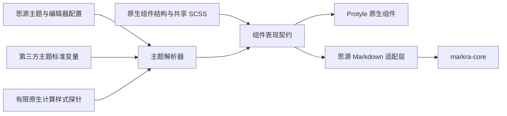

# Markdown 编辑器整体表现契约设计

## 文档状态

本设计已由用户逐节确认，覆盖 Markdown 编辑器的整体主题、布局和交互状态适配。本文取代 `docs/superpowers/specs/2026-08-12-markdown-native-theme-parity-design.md` 及其以代码块为中心的实施方案；旧方案不得继续作为实现依据。

## 背景与根因

代码块的明显差异只是整体问题的一个样本。当前 Markdown 编辑器同时受三套表现来源控制：思源原生 Protyle SCSS、`app/src/assets/scss/business/_markdown.scss` 的独立适配，以及 Markra/CodeMirror 各插件中的 `EditorView.baseTheme`。三者没有共同的组件契约，导致颜色、字体、几何、DOM 状态和交互样式分别演进。

现有 `markdownThemeBridge` 通过隐藏的原生探针复制少量计算样式，只覆盖标题、正文、引用、部分行内格式、代码和表格。它无法传递依赖 DOM 关系的布局、弹性占位、伪元素、状态选择器和组件行为。代码块已经验证这一局限：原生 Lute 输出采用 `code-block → protyle-action（语言、弹性占位、复制、更多）→ hljs`，而 Markdown 把语言和按钮放入另一套 CodeMirror 标题行，再用独立高度模拟原生内容内边距。即使背景、字体和首行偏移相同，语言位置、操作组、总高度和上下间距仍会明显不同。

现有测试也放大了该问题。布局测试使用手写的简化原生 DOM，并只比较背景、圆角、字体、首行偏移和按钮宽度，没有比较语言坐标、操作组坐标、上下留白、总高度及完整交互状态，因此会在实际 UI 明显不一致时通过。

## 目标

- 建立有限、可测试的编辑器表现契约，消除 Protyle、Markdown SCSS 和 CodeMirror `baseTheme` 之间的无约束重复实现。
- 可视化模式中，有原生对应物的内容在布局、字体、颜色、间距、圆角及交互状态上与 Protyle 一致。
- Markdown 独有功能复用思源按钮、菜单、浮层、图标、焦点和语义色体系，不伪装成不存在的 Protyle 内容块。
- 源码模式保留代码编辑器布局，但背景、字体、行高、光标、选区、行号、活动行、搜索和浮层完整适配思源主题。
- 桌面端和移动端使用同一表现契约，移动端允许按照思源原生响应式规则调整边距、控件可见性和触控尺寸。
- 支持内置明暗主题，以及使用思源标准变量、标准 Protyle 选择器或标准组件类的第三方主题。
- 通过完整组件矩阵和实际应用自测主动发现差异，不再依赖用户逐项截图反馈。

## 非目标

- 不改变 Markdown 解析、文件格式、保存、撤销、选区、输入法、粘贴和资源本地化语义。
- 不要求 Markdown 和 Protyle 使用完全相同的 DOM。
- 不让 `markra-core` 直接依赖思源全局对象、Protyle 实例或思源事件钩子类名。
- 不为依赖私有 DOM 层级或特殊伪元素的单个第三方主题编写专用补丁。
- 不在本次改造中统一导出 HTML/PDF；导出继续使用独立渲染链路。
- 不构建允许任意组件和任意 CSS 属性动态注册的通用主题引擎。

## 已确认的产品决策

- 采用“原生等价内容严格一致，Markdown 独有功能使用思源组件体系”的推荐边界。
- 源码模式纳入本次整体改造。
- 桌面端与移动端均纳入，移动端遵循响应式和触控规则。
- 统一默认、悬停、聚焦、选中、禁用、拖拽、错误和浮层状态，但不改变 Markdown 编辑语义。
- `markra-core` 保持宿主无关，思源适配集中在宿主适配层。
- 第三方主题支持标准思源变量、标准 Protyle 选择器和标准组件类；非常规覆盖使用合理回退。
- 验收采用结构、计算样式、关键几何、交互状态和运行态截图组成的完整矩阵。

## 总体架构

系统不新增一套 Markdown 视觉规范，而是建立一层“思源编辑器表现契约”。表现契约是有限的组件目录，由明确的 TypeScript 配置、宿主适配器、共享 DOM 控件和 SCSS 混入组成，不是运行时无限扩展框架。

### Protyle 原生层

Protyle 是产品视觉和交互状态的基准。只在确有重复的组件中提取共享 DOM 控件、行为控制器或 SCSS 混入，不为了 Markdown 改变原生编辑行为，也不要求一次性重写原生样式体系。

### 组件表现契约

每个组件条目至少描述组件类别、原生参考结构、支持状态、可共享实现、标准主题变量、必要探针、Markdown 映射、平台规则、几何指标和回退策略。契约目录是测试矩阵的唯一组件清单；新增可见组件时必须同时补充契约和验证项。

### 思源 Markdown 适配层

适配层把表现契约转换为 CodeMirror 装饰、根节点语义属性、宿主回调和共享控件。可直接复用的菜单、按钮和浮层使用真实公共组件；DOM 不兼容的内容使用共享 SCSS 混入和有限主题快照。

### `markra-core`

`markra-core` 继续负责 Markdown 语法、编辑、选择和装饰生命周期。它只能消费抽象的组件配置、图标、菜单回调、语义状态和编辑器设置，不读取 `window.siyuan`，也不持有 Protyle DOM。

### 主题解析器

现有 `markdownThemeBridge` 收敛为主题解析器的一部分。主题解析器优先读取标准思源变量，并仅为无法由变量表达的原生组件属性维护有限探针。它不再把任意计算属性批量转换为持续膨胀的 `--b3-markdown-*` 集合。

## 组件分类与范围

### 原生等价内容

文档标题与元数据、段落、六级标题、列表、任务项、引用、Callout、分割线、表格、代码块、图片、链接、行内代码、强调、删除线、高亮和数学公式属于原生等价内容。它们需要匹配 Protyle 的布局、字体、颜色、间距、圆角和完整交互状态。

### 编辑器基础界面

编辑区域、光标、选区、活动行、行号、占位符、滚动区域、拖拽指示、只读状态和错误状态属于编辑器基础界面。可视化模式应融入 Protyle；源码模式保留代码编辑器布局，但必须消费思源主题语义。

### Markdown 专属功能

Markdown 语法提示、源码标记、表格编辑工具、脚注预览、搜索结果、媒体查看器和围栏编辑辅助属于 Markdown 专属功能。它们与所采用的思源标准按钮、菜单或浮层比较，不与无关的 Protyle 内容块比较。

### 状态范围

每个组件按适用性覆盖默认、悬停、聚焦、选中、禁用、编辑、只读、空内容、错误、浮层展开和键盘导航状态，并覆盖浅色、深色、标准第三方主题、桌面鼠标和移动触控。

## 样式与主题解析顺序

每个组件严格按照以下顺序获取表现，不允许在后续层重复定义已经由前一层决定的属性：

1. 共享组件与共享 SCSS：按钮、菜单、浮层、图标、操作栏及可共享的内容布局优先复用同一实现。
2. 思源标准主题变量：背景、正文、边框、强调、成功、警告、错误、选区等基础语义直接使用现有 `--b3-*` 变量。
3. 有限原生计算样式探针：第三方主题只覆盖 Protyle 选择器且没有标准变量时，通过组件对应的真实原生结构读取必要属性。
4. 标准语义回退：探针缺失或主题依赖非常规结构时，回退到思源标准变量，不添加主题专用 CSS。

可以共享 DOM 和行为的组件应提取公共实现；DOM 不兼容但布局一致的组件应共享 SCSS 混入和状态规则；第三方主题仅命中原生 DOM 时才使用探针；Markdown 独有功能组合已有思源组件和语义变量。

## 运行时数据流

- 主题根属性、主题样式表、Highlight.js 样式表或编辑器配置变化后，主题解析器以合并调度方式重新生成表现快照。
- 只有新旧快照不同才更新 Markdown 编辑器根节点上的语义属性和变量，避免无效重排。
- 颜色、字体和几何样式通过 CSS 即时生效。
- 行号、换行、连字等行为配置通过 CodeMirror compartment 重新配置。
- 重新配置不得重建 `EditorView`、重新加载文档或改变选区、滚动位置、脏状态和当前模式。
- 模式切换时正文区域的背景、基础字号和可用宽度保持稳定，避免视觉跳变。

## 桌面、移动端与源码模式

桌面和移动端消费同一组件契约。平台差异只能通过契约中的响应式规则表达，例如页面边距、触控目标尺寸、悬停替代状态、操作入口常显和浮层定位，不允许复制整套移动端主题。

源码模式不模拟 Protyle 内容块布局，但必须使用同一主题解析器和思源语义状态。语法高亮允许使用代码主题，编辑器背景、正文、光标、选区、行号、活动行、搜索和浮层不得保留浏览器默认色或 Markra 独立色板。

## 第三方主题兼容边界

- 直接支持标准思源变量。
- 通过原生组件探针支持覆盖标准 Protyle 选择器和组件类的主题。
- 主题完全依赖特殊 DOM 祖先、私有属性或不可读取伪元素时，使用标准语义回退并在验收报告中记录。
- 主题切换过程中保留最后一次有效快照，直至新样式表稳定，避免短暂闪回默认主题。
- 单个主题或单个探针失败不得阻断 Markdown 编辑和渲染。

## 异常处理

- 探针元素缺失、计算属性为空或值无效时，按组件回退并在开发测试中报告组件、状态和属性名称。
- 主题解析失败不得触发编辑器重建，不得修改文档或清空现有有效快照。
- Markdown 独有组件没有精确原生映射时使用标准思源组件外观，不推断第三方主题私有实现。
- 宿主提供的共享菜单或控件不可用时，使用可访问的标准思源回退组件，并保留键盘操作。
- 插件对语言列表等扩展数据的修改必须经过类型和空值校验，单个插件异常不能使浮层不可用。

## 迁移策略

迁移按依赖顺序进行，但属于同一个整体架构改造，不接受永久保留的新旧混合状态。

1. 建立组件契约目录、真实原生夹具和当前差异基线，把现有测试盲区转成失败测试。
2. 统一编辑器根容器、正文排版、源码模式、光标、选区、活动行、滚动和移动端响应式。
3. 迁移标题、段落、列表、引用、行内格式、链接、分割线和任务项等静态内容。
4. 迁移代码块、表格、图片、Callout、数学公式和媒体等复杂块。
5. 迁移语言菜单、表格工具栏、搜索、脚注、媒体查看器、拖拽状态和错误提示等控件与浮层。
6. 每个组件通过矩阵验证后删除其旧 `baseTheme`、Markdown 专用固定参数和无用桥接变量。

当前已经加入的代码块适配不默认保留。实施时逐项判断其是否符合新契约，不符合的 DOM、样式、主题变量和测试全部替换。迁移不得修改生成文件或手工编辑 `lute.min.js`。

## 自动测试设计

### 契约测试

组件契约目录必须验证组件 ID 唯一、类别完整、原生参考存在、状态集合明确、回退变量有效，并防止新增可见组件绕过契约。

### 真实原生夹具

原生等价内容的测试夹具应由当前 Lute 生成真实 BlockDOM，或直接使用原生组件工厂。不得以缺失弹性占位、图标、内容容器和属性的手写简化 DOM 充当基准。

### 计算样式与几何

每个原生等价组件比较背景、颜色、字体、字号、字重、行高、边框、圆角、间距、内容起点、控件位置和整体宽高。计算样式应完全相等，关键几何允许最多 `1px` 差异。Markdown 独有组件与其采用的思源标准组件比较。

### 交互与生命周期

自动测试覆盖默认、悬停、聚焦、选中、禁用、展开、键盘导航、主题热切换、配置热更新和模式切换，并断言文档、选区、滚动、撤销和脏状态不变。

### 样式源约束

测试应阻止 Markdown 主题文件新增裸十六进制色、`rgb/rgba`、浏览器系统色或没有思源语义基色的独立色板。允许基于思源语义变量进行必要的透明度组合。

## 运行态验收矩阵

运行态至少覆盖可视化模式、源码模式、内置浅色、内置深色、标准第三方主题、桌面常规宽度、桌面窄页签、移动端宽度、鼠标与键盘、移动触控、编辑、只读、空内容、长内容、错误内容、主题热切换、配置热更新和模式切换。没有可用第三方主题时，使用同时覆盖标准变量和 Protyle 选择器的测试主题。

实际应用测试在独立临时文档或明确的测试工作空间中并排创建原生和 Markdown 样本，自动采集组件计算样式、边界矩形和截图，并自动执行悬停、聚焦、打开菜单、切换模式和切换主题。测试不得修改用户正在编辑的文档，完成后应清理临时内容。

截图比较允许字体抗锯齿产生的局部像素误差，但不得使用高阈值掩盖布局、尺寸或位置偏差。结构和几何判断以 DOM、计算样式和边界矩形为准，截图用于发现契约未覆盖的整体视觉问题。

## 完成条件

- 组件契约清单中的所有组件都有自动测试和实际应用运行态证据。
- 有原生对应物的 Markdown 内容通过计算样式和关键几何比较。
- Markdown 独有组件使用思源标准组件与语义变量，并覆盖全部适用交互状态。
- 可视化模式、源码模式、桌面端、移动端、内置明暗主题和标准第三方主题均通过验收矩阵。
- 主题与配置热更新不重建编辑器，不改变文档、选区、滚动和撤销状态。
- 已迁移组件不再保留重复的旧表现源或无用主题桥变量。
- Markdown 相关测试、布局测试、类型检查、项目规定的 Lint 和实际应用矩阵全部通过。
- 最终报告列出矩阵结果、截图路径和第三方主题回退项；任何纳入范围的组件没有运行态证据时，不得宣称整体适配完成。
